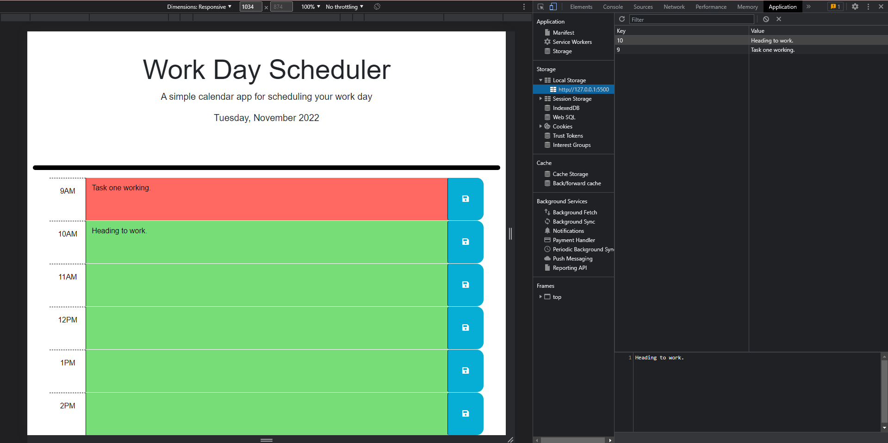

# Work Day Scheduler

## Description

This project is designed to create a working web page that offers a place to store work day events and track which hour they need to be completted and adjust its UI accordingly to the hour. The goal is for the user to store in their local storage notes at certain hours so whenever they return to view their planner, they can see what notes they have left and remove them once they are completted. Unfortunately, I was unable to complete this project after its due date however, I am glad to understand my errors. Note to self, do not mix libary and languages if I do not properly understand how to mix them. I primary stuck with using JQuery which simplified the understand and was the reason for completion.

## Insallation

N/A

## Usage

This page will serve any and all users who want to save their daily work plans in an easy to use scheduler.

Below you will find a screenshot to this website.

)

)

)

[Next will be the link you can reach the webpage at!](https://volexity21.github.io/Work-Day-Scheduler/)

## Credits

These questions were created and implimented by myself using knowledge from the Bootcamp and a variety of research sites such as W3Schools, Stack overflow, and MDN Webdocs.

[Feel free to join me through past and future projects!](https://github.com/Morralytics)
